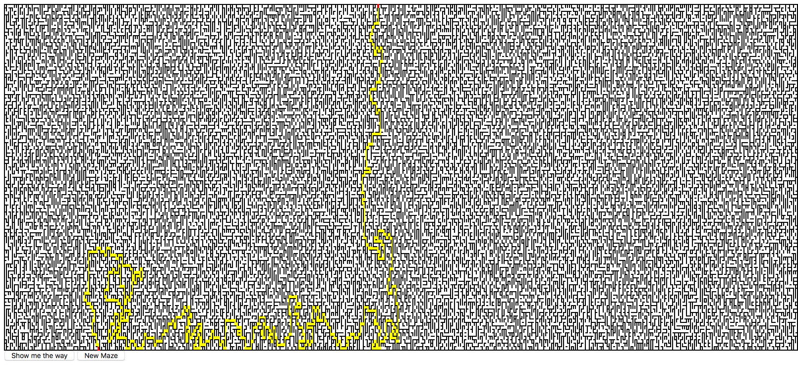
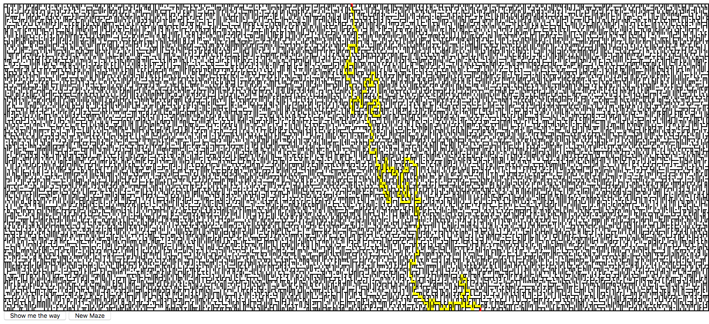

# maze-js
a simple two dimensional maze game. based on javascript

#### Usage Instructions:
import the maze.js and create a new maze as follow:
``` javascript
var maze = Maze.new(6,6); 
//draw maze by 
maze.draw();
```




